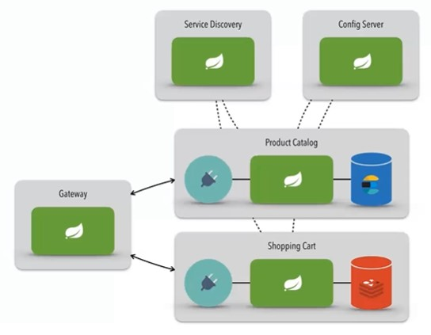

# Product-catalog / Shopping-cart Microservice
A microservice architecture example project.

Development for didactic purposes, not representing a suitable format for production environments.

The Project that is part of Santander Bootcamp Fullstack Developer, promoted by [Santander](https://app.becas-santander.com/) and [Digital Innovation One](https://web.digitalinnovation.one/). Classes presented by [Oswaldo Neto](https://github.com/oswaldoneto).

Architecture layers:
- Config-server
- Service-discovery (Eureka)
- Gateway API
- Microservices: Product-catalog and Shopping-cart

[Configuration repository for "config-server"](https://github.com/clementesc/dio-santander-springcloud-config)




Services should, by choice, be started (bootRun) in this order:
```
- config-server
- service-discovery
- gateway
- product-catalog
- shopping-cart
```